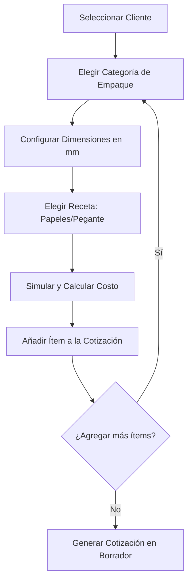

# Manual de Usuario: Cencore Operations Console
### Consola de Operaciones y Motor de Precios Industrial v2 · **Cencore SAS**

Este manual describe el funcionamiento, lógica interna, pantallas y flujos de trabajo de la **Consola de Operaciones de Cencore SAS**. Está diseñado para capacitar tanto a comerciales como a administradores en el uso del sistema de cotización industrial, gestión logística y administración de costos.

---

## 📌 Índice
1. [Introducción y Propósito](#1-introducción-y-propósito)
2. [Flujo de Trabajo del Cotizador Industrial](#2-flujo-de-trabajo-del-cotizador-industrial)
3. [Lógica del Motor de Precios e Ingeniería](#3-lógica-del-motor-de-precios-e-ingeniería)
4. [Máquina de Estados Estricta (Ciclo de Vida)](#4-máquina-de-estados-estricta-ciclo-de-vida)
5. [Flujo de Corrección y Edición de Cotizaciones](#5-flujo-de-corrección-y-edición-de-cotizaciones)
6. [Guía Detallada de Pantallas y Módulos del Sistema](#6-guía-detallada-de-pantallas-y-módulos-del-sistema)
7. [Panel de Administración y Configuración de Costos](#7-panel-de-administración-y-configuración-de-costos)
8. [Envío Automático (n8n) e Impresión de PDF](#8-envío-automático-n8n-e-impresión-de-pdf)

---

## 1. Introducción y Propósito

La **Consola de Operaciones de Cencore SAS** es una plataforma centralizada que unifica la ingeniería de empaques, el costeo de producción en tiempo real y el control comercial de ofertas. 

Reemplaza las cotizaciones manuales en Excel por un **Motor de Precios basado en Procesos Industriales** (FastAPI) conectado a una base de datos segura (Supabase). Esto asegura que:
- Los precios de venta siempre estén alineados con los costos actuales de materias primas, mano de obra e indirectos.
- Exista una trazabilidad absoluta de las cotizaciones enviadas.
- Se mantenga un control riguroso de qué ofertas han sido autorizadas para envío al cliente.

---

## 2. Flujo de Trabajo del Cotizador Industrial

El módulo de **Nueva Cotización** (`/admin/quotes/new`) permite estructurar ofertas complejas multi-ítem. Sigue este flujo paso a paso:

### Paso 1: Selección del Cliente
1. Abre el menú desplegable de **Cliente** y selecciona la empresa. El sistema cargará automáticamente el contacto, correo, NIT y dirección asociados en la base de datos.

### Paso 2: Configuración del Ítem (Planificador de Producción)
El cotizador cuenta con un planificador que requiere datos de ingeniería de empaques:
- **Categoría**: Selecciona entre **Cajas** (corrugados), **Rollos** (papel kraft), o **Esquineros** (accesorios de protección).
- **Dimensiones (mm)**: 
  - *Cajas*: Largo, Ancho y Alto.
  - *Esquineros*: Largo, Ancho de Ala y Grosor (espesor).
  - *Tubos/Envases*: Diámetro, Largo y Espesor de pared.
- **Receta de Materiales**: Configura las capas del cartón (ej. Papel Exterior, Ondas, Papel Interior) y el tipo de pegante a utilizar.

### Paso 3: Simulación y Cálculo de Costo
1. Ingresa la **Cantidad** solicitada.
2. Haz clic en **Calcular Matriz / Simular**. El sistema consultará el motor de precios FastAPI y te devolverá en segundos el desglose exacto:
   - Peso total del lote.
   - Costo unitario sugerido de producción.
   - Precio de venta sugerido con el margen comercial aplicado.
3. Haz clic en **Añadir Ítem** para guardarlo en la tabla de la cotización actual. Puedes repetir este proceso para incluir diferentes tipos de empaques en la misma oferta.

### Paso 4: Emisión de la Cotización
Una vez agregados todos los ítems:
- Selecciona si requiere **Entrega Urgente** (aplica un recargo logístico parametrizado).
- Escribe **Notas y Condiciones** comerciales si aplica.
- Haz clic en **Generar Cotización**. Se creará la oferta en estado **Borrador (`draft`)** y se abrirá la vista de detalle.

---

## 3. Lógica del Motor de Precios e Ingeniería

El motor industrial de precios calcula el valor exacto de fabricación combinando cuatro pilares:

### A. Cálculo de Peso Unitario
Dependiendo del tipo de producto, el sistema calcula la masa exacta de cartón para determinar el consumo de materia prima:
- **Tubos**: Área transversal tubular x longitud x 0.0006
- **Esquineros**: Superficie en L (Alas) x espesor x longitud x 0.0006
- **Cajas**: Área de superficie exterior x 0.5 x 0.0006
- **Láminas**: Área plana x 0.1 x 0.0006
- **Single Face**: Área plana x 0.0004

### B. Estructura de Costo de Producción
Costo Total = Materia Prima + MOD + CIF + NIF

1. **Materias Primas (Papel y Pegante)**: 
   Peso Unitario x Costo por KG de Material x Cantidad x Factor de Desperdicio
2. **Mano de Obra Directa (MOD)**: 
   ((Cantidad / Velocidad de Máquina) + Tiempo de Setup) x Tarifa Hora Categoría x Multiplicador
3. **Costos Indirectos de Fabricación (CIF)**: Sobrecosto asociado a operarios y mantenimiento de planta, calculado como un factor porcentual del MOD.
4. **Gastos No Industriales Fijos (NIF)**: Prorrateo de costos administrativos mensuales y arriendos con base en las horas de máquina utilizadas.

---

## 4. Máquina de Estados Estricta (Ciclo de Vida)

Para evitar el envío de cotizaciones desactualizadas o sin autorización, la consola implementa una **máquina de estados con transiciones estrictas**. Los comerciales no pueden cambiar libremente el estado en cualquier dirección. Las reglas de flujo son:

- **Borrador (`draft`)**: Solo permite enviar a **Revisión** o **Rechazar**.
- **En Revisión (`review`)**: Permite cambiar a **Aprobada**, **Rechazada** o revertir a **Borrador**.
- **Aprobada (`approved`)**: Permite revertir a **Revisión** o **Enviar al Cliente** (lo cual cambia el estado a **Enviada**).
- **Rechazada (`rejected`)**: Permite cambiar a **Borrador** para corregir.
- **Enviada (`sent`)**: No tiene transiciones directas en el panel de estados para proteger la facturación.

---

## 5. Flujo de Corrección y Edición de Cotizaciones

Si una cotización en estado **Enviada**, **Rechazada** o **Borrador** requiere modificaciones físicas (cantidades, materiales o dimensiones):

1. Ingresa al detalle de la cotización en `/admin/quotes/[id]`.
2. Haz clic en el botón premium **Corregir / Editar**.
3. El sistema te redireccionará automáticamente al formulario del planificador de producción, precargando todos los datos del cliente, condiciones e ítems previamente calculados.
4. **Importante (Protección del Sistema)**: Para proteger la integridad histórica de las ventas, **al guardar la corrección, el estado de la cotización se restablecerá automáticamente a Borrador (`draft`)**.
5. Deberás pasar nuevamente la cotización por el proceso de aprobación rápida (`review` ➔ `approved`) antes de reenviarla al cliente por correo. Esto previene que se despachen modificaciones sin autorización.

---

## 6. Guía Detallada de Pantallas y Módulos del Sistema

La aplicación está dividida en módulos accesibles desde la barra lateral de navegación para gestionar de forma intuitiva cada proceso:

### A. Gestión de Clientes (`/admin/clients`)
Este módulo centraliza la información comercial y fiscal de las cuentas de Cencore SAS.
* **Barra de Búsqueda Dinámica**: Filtra al instante el listado de clientes por nombre, NIT, contacto o ciudad sin necesidad de recargar la página.
* **Formulario de Registro Modal**: Al presionar **Nuevo Cliente**, se abre un formulario optimizado para ingresar:
  - Razón Social / Nombre Comercial.
  - NIT (con dígito de verificación).
  - Nombre del Contacto Principal.
  - Correo Electrónico *(Crucial: Dirección donde n8n enviará las cotizaciones de forma automática)*.
  - Teléfono o celular.
  - Dirección y Ciudad de entrega.
* **Edición y Control de Registros**: Permite actualizar los datos fiscales del cliente en un solo clic y eliminar cuentas inactivas siempre y cuando no tengan registros de cotizaciones históricas asociadas.

### B. Catálogo de Referencia Visual de Productos (`/admin/products`)
Este módulo sirve como biblioteca digital de referencia para el equipo de ventas y no como inventario fijo, ya que los empaques siempre se cotizan a la medida.
* **Tarjetas de Producto (Cards)**: Presentación premium de cada empaque del catálogo mostrando:
  - Imagen del producto (subida directamente a Supabase Storage).
  - Nombre técnico y descripción detallada del uso recomendado.
  - Categoría del empaque (Tubos, Esquineros, Cajas, Láminas, Single Face).
  - Etiqueta de Estado (`Activo` o `Inactivo`).
* **Carga de Imágenes Integrada**: Al presionar **Nuevo Producto**, el formulario incluye un cargador interactivo de archivos. Las fotos son almacenadas automáticamente en los Buckets de Supabase Storage generando URLs seguras.
* **Mensaje de Separación Comercial**: Un aviso persistente recuerda al comercial que para fijar precios debe ir al Planificador de Producción, puesto que en este catálogo las especificaciones son referenciales.

### C. Configuración de Parámetros Globales (`/admin/settings/pricing`)
Configuración financiera transversal para calibrar el comportamiento económico de la empresa.
* **Margen Estándar de Utilidad**: Permite definir el porcentaje global de ganancia (establecido por defecto en 25%) que se aplica sobre el costo total calculado.
* **Recargo por Urgencia**: Parametrización del porcentaje adicional de recargo logístico y de producción (ej. 10%) si se marca la casilla "Entrega Urgente" durante la cotización.

---

## 7. Panel de Administración y Configuración de Costos

Ubicado en `/admin/costs`, este panel es de acceso exclusivo para administradores y sirve como el "cerebro de costos" del sistema:

### A. Papeles y Pegantes (Inline)
- Administra el catálogo de papeles Kraft, Test Liner, etc., indicando su gramaje y costo por kilogramo.
- Permite crear nuevos tipos de pegantes e insumos industriales de manera inmediata con guardado automático.

### B. Rutas de Proceso y Líneas de Producción
- Configura las velocidades nominales de máquina (unidades/hora) para cada línea (Tubos, Esquineros, Cajas).
- Establece el tiempo de setup o preparación de máquina y el número de operarios estándar necesarios.

### C. Costos Indirectos y Fijos (Vigencias Temporales)
Para modelar la inflación y costos reales del negocio, los costos indirectos (Arriendo, Servicios Públicos, Nómina, Mantenimiento) se manejan por **Vigencias Temporales**:
- Al crear o modificar un costo fijo, debes asignar una **Fecha de Inicio** y **Fecha de Fin**.
- El motor de precios solo tomará los costos fijos cuya fecha actual se encuentre dentro de la vigencia especificada.
- Esto permite programar incrementos de tarifas sin afectar el cálculo histórico de cotizaciones anteriores.

---

## 8. Envío Automático (n8n) e Impresión de PDF

### A. Generación de PDF Limpio (window.print)
La plataforma cuenta con un sistema de hojas de estilo `@media print` optimizado:
- Al hacer clic en **Imprimir / PDF** desde el detalle, se genera un documento A4 limpio y profesional.
- **Ocultamiento automático**: La barra de navegación lateral, el encabezado del sistema y los botones de acción se ocultan por completo de la hoja de impresión.
- Se inyecta automáticamente un encabezado corporativo premium de **Cencore SAS** con su NIT y logotipo únicamente visibles en el papel o archivo PDF resultante.

### B. Envío por Email Automatizado (n8n Cloud)
- Al hacer clic en **Enviar al Cliente**, la aplicación Next.js valida que la cotización esté en estado **Aprobada (`approved`)**.
- Lanza una petición segura a la nube de **n8n Cloud** (`jkmilo8.app.n8n.cloud`), la cual genera la cotización estructurada y despacha un correo automatizado directamente a la dirección del cliente con los términos comerciales y el desglose de precios.
- Si el envío es exitoso, el estado de la cotización pasa automáticamente a **Enviada (`sent`)**.
